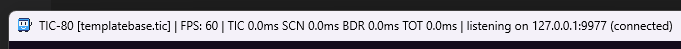

# ticbuild

A build & watch system for TIC-80 cart development.

* Multi-file Lua dev system
* Watch system: live-update a running tic80 when dependent files are updated.
* Timing and profiling information
* Import data from existing carts
* Rich Lua preprocessing
* Code size up to 512kb
* Arbitrary binary & text importing, decoding, encoding.

## Links

* [TIC-80 homepage](https://tic80.com/)
* [ticbuild on Github (this project)](https://github.com/thenfour/ticbuild)
* [ticbuild_vscode on Github](https://github.com/thenfour/ticbuild_vscode)
* [Discord](https://discord.gg/kkf9gQfKAd)
* [Somatic - web-based TIC-80 music tracker](https://somatic.tenfourmusic.net/)


This project is free, a labor of love; if you find it useful, please support by spreading the word or,

[](https://ko-fi.com/E1E71QVJ5Z)

# 2-minute quick start

The best dev experience is through:

* Windows
* VS Code as your editor

If you're cool with that, this is going to be easy. Open a command prompt and follow this:

```bash
# Install ticbuild so it's usable on the system as `ticbuild`
> npm install -g ticbuild

# go where you want to create the project
> cd c:\my_projects

# Initialize a minimal example project
> ticbuild init MyDemo

# Open VS Code
> code MyDemo
```

In VS Code, hit <kbd>F5</kbd> to build and watch for changes. A TIC-80 opens
with the example project.

Open `src/main.lua`. Change the background color:

```lua
  cls(9) -- changed from cls(0)
```

When you save the file, violà, the TIC-80 shows the new background color.

Also notice the TIC-80 shows timing and FPS information.



For the full experience, now install [the VS Code syntax highlighting extension](https://marketplace.visualstudio.com/items?itemName=TridentLoop.ticbuild-vs-code)

And you will get full syntax highlighting for the Lua language extensions.

# Installation

Install ticbuild globally using npm:

```bash
npm install -g ticbuild
```

## Lua preprocessor + syntax highlighting

See [ticbuild_vscode](https://github.com/thenfour/ticbuild_vscode) for adding
syntax highlighting to make the Lua preprocessing more friendly in VS Code.


## Prerequisites

- Windows (most is cross-platform however launching is strictly windows)
- Node.js (v16 or higher)

# How to use: overview

```bash

# see detailed help
ticbuild help

# see help for a specific command
ticbuild help build

# build from manifest -> .tic cart
ticbuild build

# build and launch in a tic80
ticbuild run

# build and live-update with changes in a tic80
ticbuild watch

# create a new empty project
ticbuild init

```

## TIC-80 binary location

By default, `ticbuild` will use a special build of TIC-80 which allows profiling and
interop to support remote control.

If you want to use your own or external TIC-80, set an environment variable
(via `.env` and `.env.local`) `USE_EXTERNAL_TIC80=1`.

The TIC-80 location is searched in the `%PATH%`, but otherwise it can be overridden
via `.env` / `.env.local` in the project directory, with the key `TIC80_LOCATION`,
as a full path to `tic80.exe`.

```bash
USE_EXTERNAL_TIC80=1                    # use own build of tic80.exe. defaults to falsy
TIC80_LOCATION=c:\my\custom\tic80.exe # optional. ignored without USE_EXTERNAL_TIC80=1
```

# Project manifest

The manifest file is canonically `*.ticbuild.jsonc`. Its location defines the project root.

```jsonc
// paths are always relative to the manifest file's dir (which defines the project root dir)
// fyi, reference: https://github.com/nesbox/TIC-80/wiki/.tic-File-Format
{
  "$schema": "./ticbuild.schema.json",
  "project": {
    "name": "my demo",
    "includeDirs": ["./src", "./include"], // includes these dirs in source file lookup
    "importDirs": ["./assets", "./images"], // include these dirs in resource import lookup
    "binDir": "./dist/bin",
    "objDir": "./dist/obj",
    "outputCartName": "$(project.name).tic", // leaf name only
  },
  "variables": {
    "anything": "here", // variables can be referred to in values via $(variablename)
  },
  "imports": [
    {
      "name": "maincode", // symbolic identifier
      "path": "main.lua",
      "kind": "LuaCode", // defines the type of importer to handle this.
    },
    {
      "name": "twilight_bog_palette", // https://lospec.com/palette-list/twilight-bog
      "kind": "binary", // the imported resource is treated as binary data.

      // the way it's represented in its source may not be a binary file; we can decode the source data.
      // see below for detailed info about encoding types
      "sourceEncoding": "hex",
      // like other resources, loading from file is fine:
      // "path": "path_to_file.bin"

      // but you can also just specify the value here.
      // NOTE: as with all (most?) manifest values, string substitions are performed so variables
      // can be used.
      "value": "1f17143439434e5a6d5d8da289baabb8cfb9839c77727546383f38704b63a66470b8948ec8bfbfe1e6eaa48db6785a96",
    },
    {
      "name": "scroll_text",
      "kind": "text", // the imported resource is treated as plain text
      // like other resources, loading from file is fine:
      // "path": "path_to_file.txt"
      // but you can also just specify the value here. Again, string substitution is supported.
      "value": "greetz to everyone at the party coding is omg so beer fartschnapps",
    },
    // it is not necessary to specify all source files here; main.lua can import
    // files directly by relative path.
    {
      "name": "myGraphics",
      "path": "./carts/sprites.tic", // imports from some other cartridge
      // you can specify which chunks to bring in. The chunk types are hard-coded
      // corresponding to the TIC-80 cart chunks.
      // Bringing in multiple chunks though means that 1 import can have multiple
      // sub-assets. In this case, "myGraphics" contains tiles and sprites.
      // asset types are so far just mapped directly to tic80 cart chunk types.
      // but in the future it could be that we support our own types of imports
      // for example a .MOD, or a .TTF or graphics.
      //
      // It means when you refer to an import ("myGraphics") you need to specify
      // which sub asset you actually want. Scenarios:
      // 1. the requseted chunks matches exactly the asset chunks: e.g. for cart
      //    assembly, you specify blockTypes:["TILES", "SPRITES"], and asset "myGraphics",
      //    it will just both sub-assets without needing to specify.
      // 2. if you don't specify the chunks desired, all will be used. Errors would
      //    be produced if the destination doesn't support that chunk type.
      // 3. if the requested chunks don't match the available, this is an error.
      //    In this case you must be explicit about what you want to import.
      // (that's the idea...)
      //
      // if import.chunks is omitted, extract all chunks from source.
      // if block.chunks is omitted, use all chunks the asset provides.
      "chunks": ["TILES", "SPRITES"],
      "kind": "Tic80Cartridge", // again this could be deduced.
    },
    {
      "name": "music-imported-cart",
      "path": "./carts/song.tic",
      // you can also omit the chunks and we'll just import all available from a cart.
      "chunks": [
        "CODE",
        "MUSIC_WAVEFORMS",
        "MUSIC_PATTERNS",
        "MUSIC_SFX",
        "MUSIC_SONG",
      ],
      // MAYBE in the future we can add other ways to query like to pull in a specific sprite.
      // but for now not necessary.

      // Note: the code that's imported from a cart can contain ticbuild preprocessing directives.
      // this could be useful for example in Somatic, to wrap TIC() with a --#if false --#endif
      // which would basically remove the entrypoint
    },
  ],
  "assembly": {
    "lua": {
      "minify": true,
      "minification": {
        // options here are exactly those of OptimizationRuleOptions
        // these are all the default values if not specified.
        "stripComments": true,
        "maxIndentLevel": 1,
        "lineBehavior": "tight", // "pretty" | "tight" | "single-line-blocks";
        "maxLineLength": 180,
        "aliasRepeatedExpressions": true,
        "renameLocalVariables": true,
        "aliasLiterals": true,
        "packLocalDeclarations": true,
        "simplifyExpressions": true,
        "removeUnusedLocals": true,
        "removeUnusedFunctions": false,
        "functionNamesToKeep": ["TIC", "BDR", "SCN"], // TIC-80 constants by default
        "renameTableFields": false,
        "tableEntryKeysToRename": [],
      },

      // optional global variables to emit in lua code.
      // they are written out as `local variableName = xyz` at the top of the code.
      // you cannot specify where it gets emitted.
      // what datatype though? string, number, or boolean?
      "globals": {
        "PROJECT_NAME": "$(project.name)", // by default everything is a string.
        "ENABLE_HUD": true, // this can be a boolean to emit as boolean.
        "PI": 3.14159, // emits as a number.
        // no way currently to emit substituted variables as anything but strings.
      },
    },
    "blocks": [
      {
        // error if overlapping chunks.
        // this chunk type "CODE" is technically redundant because the asset already has the chunk type attached.
        // you can specify CODE_COMPRESSED for the ZLIB compressed version.
        "chunks": ["CODE"],
        "bank": 0,
        "asset": "maincode",
        "code": { // optional code assemblyl options
          // if true, emits the globals defined in assembly.lua.globals.
          "emitGlobals": true,
        }
      },
      {
        // Note: Binary resources can be output to any chunk type. they just get placed there
        // with no regards of format / packing. Often you want to store custom resources in places like
        // the large MAP area.
        "chunks": ["MAP"],
        "asset": "some_binary_file"
      },
      {
        // produces a view of the import with just the 1 MUSIC_WAVEFORMS sub-asset
        // Without specifying the chunks to produce, this automatically implies chunks: ["MUSIC_WAVEFORMS"].
        // if you explicitly specify "chunks":["TILES"], this would binary copy the waveforms to the tiles.

        // canonical form:
        "asset": { "import": "music-imported-cart", "chunks": ["MUSIC_WAVEFORMS"] },

        // optional sugar method that resembles how Lua includes assets.
        //asset: "import:music-imported-cart:MUSIC_WAVEFORMS",
      },
    ],
  },

  "buildConfigurations": {
    // build configurations allow overriding things in the base config above.
    // you cannot override individual elements of arrays. for example, `assembly.blocks`
    // if you override that, you must overwrite the whole value.
    // similar with includeDirs, you can't "add 1" or so; you have to replace the whole array.
    "debug": {
      "project": {
        "binDir": "./debug/bin",
        "objDir": "./debug/obj",
      },
      "variables": {
        "anything": "overridden",
      },
      "assembly": {
        "lua": {
          "minify": false, // overrides
        },
      },
    },
  },
};
```

# Lua preprocessor

ticbuild supports a fairly sophisticated Lua preprocessor, so you can have interaction
between files, inline macros, access project variables, import assets, conditionally branch,
and even import binaries with various encodings.

```lua
-- Simple text-based Lua preprocessor.
-- we want to support a few preprocessor features, and make the syntax not totally
-- break the language syntax. therefore, we will put it in comments.
-- Expressions and syntax should feel Lua-ish (not C++-ish, despite the preprocessor
-- directive set being C++-like).

--#pragma once -- useful for utils that will get included by multiple things.

--#define DEBUG 1
--#define SHOW_HUD -- bool-ish evals to true.
--#define PI 3.14

-- Expressions are Lua, and are evaluated immediately on parse.
--#define TAU PI*2
print() --#define XYZ -- note that here #define will not be processed.
  --#define XYZ -- but here it will be (whitespace allowed before)

-- Note that #defines do NOT result in Lua symbols or text replacement; they are
-- not macros, they are only recognized in other preprocessor directives.

--#include "utils/math.lua" -- extra comments are allowed in directive lines.
--#include "import:music-imported-cart:CODE" -- includes the imported code sub-asset from that cart
--#include "import:cart-with-only-code-chunk" -- implicit code-only import. If that cart contains more than CODE chunks, then you MUST specify ":CODE".

-- you can set variables that the included file can read
-- note that #pragma once will key against the filename AND its input variables.
-- the key/value style is Lua.
--#include "bayerKernel.lua" with { BAYER_SIZE = 4, DEBUG = true }

--#if DEBUG
print("debug")
--#else
-- something
--#endif -- DEBUG

--#if BAYER_SIZE == 4
-- ...
--#endif

--#if not defined(MAX_VOICES)
--#define MAX_VOICES 8
--#endif

-- Undefined preproc symbols shall not be `nil` even if that might feel natural.
-- using them in an expression shall be an error. Testing existence must be done
-- via `defined()`.

-- To be as "lua" as possible, `then` may feel natural at the end of that line,
--#if (MAX_VOICES < 4) then
--...
-- but don't support this. doesn't add anything and making it optional is unnecessary
-- complexity.

-- undefine:
--#undef MAX_VOICES

-- Access build system variables through a special function-like symbol
-- this will perform string substitutions and return the string. It will be done
-- at the preprocessor level though, and emitted as a string literal.
local s = __EXPAND("the project name is: $(project.name)")

-- Import binary data with various encodings, emits as lua literal.
-- this is for kind=binary imports.
-- first arg is the *output* encoding.
-- second arg is an import reference, same syntax as #include
local paletteString = __IMPORTBIN("hex", "import:twilight_bog_palette")
-- generates:
local paletteString = "1f17143439434e5a6d5d8da289baabb8cfb9839c77727546383f38704b63a66470b8948ec8bfbfe1e6eaa48db6785a96"

-- U8, S8, U16, S16, U32, S32 output tables of numbers from the binary input
local paletteString = __IMPORTBIN("s32", "import:twilight_bog_palette")
-- generates:
local paletteString = {873731871,1515078457,-1567793811,-1196705143,-1669088817,1182102135,1882734392,1688625995,-1902856080,-507527224,-1918571802,-1772455754}

-- base85+1 is base85 encoding with a prefix char describing the length remainder.
local paletteString = __IMPORTBIN("b85+1", "import:twilight_bog_palette")
-- generates:
local paletteString = "!*u>VJ3C?PFD-`-qM7Tatcae[uGB.gq3'TBA94Oi0E4D-maM5LKk3Ab%[WkuA"

-- LZ compression possible. The payload is compressed, then encoded with base85+1.
local paletteString = __IMPORTBIN("lz85+1", "import:twilight_bog_palette") -- LZ compressed binary + base 85 encoding
-- generates:
local paletteString = "#!&,K2'Jqg;:0ML?NM;9@X16KdK:I.+F[e>T3,hN#VIXYUP`Ei\"^Z\">?UlDg->*]-g"

-- while it seems like "import:" is redundant, it's necessary because
-- it stays consistent with #include syntax and allows shared parsing/handling of import reference spec strings.

-- Literals are not supported and should error. Reasoning:
-- 1. we don't know the source encoding
-- 2. we don't want to create another weird syntax like "hex:123456"
-- 3. we don't want to make overloads of this function just for literals.

-- ...So we make another function: __ENCODE where you must specify the input encoding,
-- output encoding, and the literal source value.
-- only string-based source encoding types are supported (so no LZ for example, but lz85+1 is ok)
local paletteString = __ENCODE("hex", "b85+1", "1f17143439434e5a6d5d8da289baabb8cfb9839c77727546383f38704b63a66470b8948ec8bfbfe1e6eaa48db6785a96")
-- generates:
local paletteString = "!*u>VJ3C?PFD-`-qM7Tatcae[uGB.gq3'TBA94Oi0E4D-maM5LKk3Ab%[WkuA"
-- ...without requiring an import at all to perform the encoding.
-- note the extra param. This version of __IMPORTBIN is (sourceEncoding, destEncoding, value)
-- where the value is processed the same as if it was in the manifest "value" key.

-- NOTE: both parameters support $(variables). string substitution is performed.

-- allows emitting a string literal from an imported text resource.
local scrollText = __IMPORTTEXT("import:scroll_text")

-- once again, "import:" is required for consistency, and to allow literals (though it's not much
-- value but there for completeness.)
-- string substitution is performed.
local s = __IMPORTTEXT("the project name is: $(project.name)") -- effectively the same as __EXPAND

-- macros are handy esp for writing optimized code (avoid symbol lookups, plus give
-- the minifier the chance to simplify / reduce expressions.
-- note that the macro call site should still be valid lua. similar reasoning
-- as preprocessor directives, and for example if the call site is `@clamp`,
-- things like autocomplete & formatting just won't work.
-- so like C, just blend in as a normal symbol and it's up to developers to avoid
-- conflicts.
-- by convention i'm guessing best to go all upper-case, and/or double-underscore prefix.
--#macro CLAMP(x, lo, hi) -- or __CLAMP
  ((x) < (lo) and (lo) or (x) > (hi) and (hi) or (x))
--#endmacro

-- example usage
local y = CLAMP(x + blah(y),
  0,
  1)

-- single-line macro syntax uses the arrow operator.
--#macro ADD(a, b) => ((a) + (b))

-- parameterless syntax is possible
--#macro PROJECT_NAME => __EXPAND("the project name is: $(project.name)")

```

# Code chunk behavior

Code chunk banks on cart are semantically slightly different than other chunk
types. Most of the time it's the simple, independent banks.

But when code is loaded by TIC-80, all code banks are concatenated in sequence.

Therefore, it's a warning to specify the bank explicitly for code chunks. But still
allowed as long as there's no conflict.

But if code wants to span multiple banks (larger than 1 bank), then no specified code banks should be
allowed (this is an error).

And for the code chunk alone, if code is larger than 1 bank, it gets automatically
split across multiple banks.

# FAQ / troubleshooting

## during build i see `fatal: No names found, cannot describe anything.`

Occurs when there are no git tags defined.

