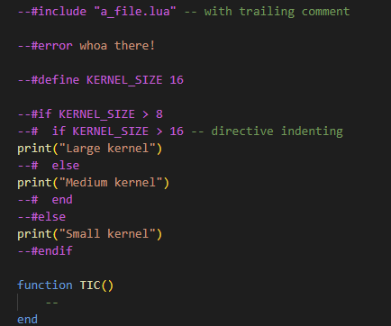

# ticbuild

A build & watch system for TIC-80 cart development.

* Multi-file Lua dev system
* TypeScript transpiling natively supported (yes, write TIC-80 carts in a typed language)
* Watch system: live-update a running tic80 when dependent files are updated.
* Sprites, music, map data import from existing carts
* Lua preprocessing (`#include`, `#macro`, `#if`, et al)
* Code size up to 512kb
* Timing and profiling information
* Encoding, importing tools

## Links

* [TIC-80 homepage](https://tic80.com/)
* [ticbuild on Github (this project)](https://github.com/thenfour/ticbuild)
* [ticbuild_vscode on Github](https://github.com/thenfour/ticbuild_vscode)
* [Discord](https://discord.gg/kkf9gQfKAd)
* [Somatic - web-based TIC-80 music tracker](https://somatic.tenfourmusic.net/)


This project is free, a labor of love; if you find it useful, please support by spreading the word or,

[](https://ko-fi.com/E1E71QVJ5Z)

# 2-minute quick start

The best dev experience is through:

* Windows
* VS Code as your editor

If you're cool with that, this is going to be easy. Open a command prompt and follow this:

```bash
# Install ticbuild so it's usable on the system as `ticbuild`
> npm install -g ticbuild

# go where you want to create the project
> cd c:\my_projects

# Initialize a minimal example project
> ticbuild init MyDemo

# Open VS Code
> code MyDemo
```

In VS Code, hit <kbd>F5</kbd> to build and watch for changes. A TIC-80 opens
with the example project.

Open `src/main.lua`. Change the background color:

```lua
  cls(9) -- changed from cls(0)
```

When you save the file, violà, the TIC-80 shows the new background color.

Also notice the TIC-80 shows timing and FPS information.


For the full experience, now install [the VS Code syntax highlighting extension](https://marketplace.visualstudio.com/items?itemName=TridentLoop.ticbuild-vs-code)

And you will get full syntax highlighting for the Lua language extensions.

# Installation

Install ticbuild globally using npm:

```bash
npm install -g ticbuild
```

## Lua preprocessor + syntax highlighting

See [ticbuild_vscode](https://github.com/thenfour/ticbuild_vscode) for adding
syntax highlighting to make the Lua preprocessing more friendly in VS Code.




## Prerequisites

- Windows (most is cross-platform however launching is strictly windows)
- Node.js (v16 or higher)

# How to use: overview

```bash

# see detailed help
ticbuild help

# see help for a specific command
ticbuild help build

# build from manifest -> .tic cart
ticbuild build

# build and launch in a tic80
ticbuild run

# build, live-update, and attach an interactive TIC-80 terminal
ticbuild watch

# interactive Lua preprocessing/minification REPL
ticbuild repl

# create a new empty project
ticbuild init

```

## Machine-readable build output

`ticbuild build` uses the human-readable reporter by default. Use the JSONL
reporter when another program needs to consume build messages:

```bash
ticbuild build --reporter jsonl
```

Every build also produces `build.jsonl` in the obj dir.

The JSONL reporter writes one JSON object per line. Lines look like:

```json
{"version":1,"type":"comment","data":{"message":"Loading imported resources..."}}
```

- `version` is the schema/contract version.
- `type` determines the shape of `data`.
- `data` contains raw values such as byte counts, durations, resolved paths...
  Human-readable formatting is not part of the JSONL contract.

Version 1 defines these message types:

- `project.loadedFrom`: resolved source manifest path.
- `manifest.resolved`: path of the generated resolved manifest.
- `comment`: display-only text. Readers must not derive build semantics from it.
- `diagnostic`: a warning or error message.
- `lua.codeSize`: raw Lua chunk sizes, capacities, and bank usage.
- `lua.minification`: emitted when Lua's 200-active-local limit causes profitable aliases to be omitted;
  includes the constrained function, peak existing/generated locals, per-rule omissions, and estimated bytes not saved.
- `cart.usage`: raw emitted-cart chunk and total-size information.
- `build.completed`: successful terminal message with duration, log path, and cart path.
- `build.failed`: failed terminal message with the error text.

## REPL mode (interactive preprocessing/minification)

Interactive Lua processing on the command line, using the same context as
the build process. Useful for testing / debugging, or just doing some ad-hock
encoding.

Note: It doesn't actually EXECUTE the Lua. Just outputs the preprocessed + minified
Lua code.

### Usage

```bash
ticbuild repl [manifest] [--multi-line] [--mode <name>] [--var <key=value>]
```

* **Manifest and build configuration**
  * The REPL loads the project in the same way as `build`.
  * `--mode` and `--var` are supported

* **Single-line mode (default)**
  * Each line you enter is processed immediately.
  * The resulting Lua code is printed to stdout after each line.

* **Multi-line mode**
  * Enable with `--multi-line`.
  * Input is collected until a terminator is entered on its own line:
    * `:end`, `:eof`, or a lone `:`
  * Once the terminator is received, the full block is processed and printed.

### REPL commands

Commands always start with `:`.

```
:help
:minify on
:minify off
:minify <rule> on
:minify <rule> off
:end
:eof
:
:quit
```

#### `:minify` details

* `:minify on|off` toggles overall minification for the session.
* `:minify <rule> on|off` overrides an option umbrella, specialized option, or
  optimizer plugin. Option names:

```
stripComments
renameLocalVariables
aliasRepeatedExpressions
aliasLiterals
simplifyExpressions
removeUnusedLocals
removeUnusedFunctions
renameTableFields
packLocalDeclarations
canonicalizeSyntax
simplifyControlFlow
renameSpecifiedGlobalSymbols (legacy opt-in switch)
```

Every optimizer plugin can also be overridden by its finer rule ID, even when
its umbrella is disabled.

The rule IDs are:

```
syntax.strip-comments
reduce.simplify-expressions
reduce.inline-immutable-scalars
reduce.inline-immutable-aliases
reduce.inline-single-use-expressions
reduce.remove-self-assignments
reduce.remove-straight-line-dead-stores
syntax.member-access
syntax.bare-table-key
syntax.omit-local-nil
control-flow.invert-negated-if
control-flow.resolve-constant-if
control-flow.remove-false-while
reduce.remove-unused-locals
reduce.remove-unused-parameters
reduce.remove-unused-for-variables
reduce.remove-unused-functions
introduce.alias-literals
introduce.alias-repeated-expressions
finalize.pack-local-declarations
rename.local-variables
rename.allowed-globals
rename.allowed-table-keys
rename.table-fields
```

These overrides are applied on top of the manifest’s
`assembly.lua.minification` settings.

### Examples

```bash
# default single-line mode
ticbuild repl

# multi-line input mode
ticbuild repl --multi-line
```

### dev-only Lua optimizer sandbox

```bash
npm run dev:lua-optimizer
```

Starts a web app for exploring the Lua minification options. It's possible to operate
the server over a specific project / build configuration:

```powershell
$env:TICBUILD_PLAYGROUND_MANIFEST = "C:\path\to\project.ticbuild.jsonc"
$env:TICBUILD_PLAYGROUND_MODE = "release"
npm run dev:lua-optimizer
```

Also available are:

- `npm run build:lua-optimizer`
- `npm run preview:lua-optimizer`

## TIC-80 binary location

By default, `ticbuild` will use a special build of TIC-80 which allows profiling and
interop to support remote control.

If you want to use your own or external TIC-80, set an environment variable
(via `.env` and `.env.local`) `USE_EXTERNAL_TIC80=1`.

The TIC-80 location is searched in the `%PATH%`, but otherwise it can be overridden
via `.env` / `.env.local` in the project directory, with the key `TIC80_LOCATION`,
as a full path to `tic80.exe`.

```bash
USE_EXTERNAL_TIC80=1                    # use own build of tic80.exe. defaults to falsy
TIC80_LOCATION=c:\my\custom\tic80.exe # optional. ignored without USE_EXTERNAL_TIC80=1
```

# Project manifest

The manifest file is canonically `*.ticbuild.jsonc`. Its location defines the project root.

```jsonc
// paths are always relative to the manifest file's dir (which defines the project root dir)
// fyi, reference: https://github.com/nesbox/TIC-80/wiki/.tic-File-Format
{
  "$schema": "./ticbuild.schema.json",
  "buildConfiguration": "release", // base configuration name (required, gets overridden by other configs)
  "project": {
    "name": "my demo",
    "launchArgs": ["--fs=./", "--skip"], // args that are passed to the tic80 when launched.
    "includeDirs": ["./src", "./include"], // includes these dirs in source file lookup
    "importDirs": ["./assets", "./images"], // include these dirs in resource import lookup
    // optional extra watch targets used by ticbuild watch
    "additionalWatchGlobs": ["./tools/**/*.json", "./shared/**/*.lua"],

    // emits metadata comments at the top of the final Lua source, after
    // minification so it survives normal comment stripping.
    // emitted in the insertion order.
    // values must be single-line strings.
    "metadata": {
      "title": "game title",
      "author": "game developer, email, etc.",
      "menu": "MENU1 MENU2 MENU3"
    },
    "binDir": "./dist/bin",
    "objDir": "./dist/obj",
    "outputCartName": "$(project.name).tic", // leaf name only

    // Upon build, ticbuild checks that your manifest schema is in sync with the expected
    // schema. This schema doesn't affect the build, but it helps editors understand
    // the manifest structure, provide auto-complete, validation, etc.
    //
    // This is true by default. If the project's schema file is different than
    // what ticbuild is expecting, then ticbuild will update it.
    // Setting to false will leave your existing schema untouched. Could be useful to 
    // keep commits cleaner?
    //
    // Note that this is only done at build-time. So if you want to manually update the schema,
    // you need to trigger a build. Even if the build doesn't complete, the sync is performed.
    //
    // Q: why check content, not a version?
    // A: - versions are annoying to track, room for error
    //    - there is no scenario where the content check would be less accurate
    // Q: what if the schema doesn't exist in the first place? will it get placed?
    // A: Yes. Ticbuild will create `.ticbuild/` and place the schema there.
    //
    // Q: What if $schema points elsewhere?
    // A: Ticbuild will assume the user is managing it; do the check, warn if content mismatch.
    //    Ticbuild in this case will not change the $schema path, and won't touch the schema file.
    "autoUpdateManifestSchema": true,
  },
  "variables": {
    "anything": "here", // variables can be referred to in values via $(variablename)
  },
  "preprocessor": {
    "defines": {
      "RELEASE": true,
      "GEOSPHERE_SUBDIVISIONS": 3,
      "CURVE_BETA": 0.998,
      "TITLE": "$(project.name)", // variable substitutions is performed just like most things in the manifest.
      "SUBTITLE": "The best one ever"
    }
  },
  "imports": [
    {
      "name": "maincode", // symbolic identifier
      "path": "main.lua",
      "kind": "LuaCode", // defines the type of importer to handle this.
    },
    // multiple code imports: they will be made available
    // in code as --#include "import:otherCodeAsset"
    // but the code bank can only reference one code asset and multiple code banks
    // are explicitly not supported (ticbuild manages code banking).
    {
      "name": "twilight_bog_palette", // https://lospec.com/palette-list/twilight-bog
      "kind": "binary", // the imported resource is treated as binary data.

      // the way it's represented in its source may not be a binary file; we can decode the source data.
      // see below for detailed info about encoding types
      "sourceEncoding": "hex",
      // like other resources, loading from file is fine:
      // "path": "path_to_file.bin"

      // but you can also just specify the value here.
      // NOTE: as with all (most?) manifest values, string substitions are performed so variables
      // can be used.
      "value": "1f17143439434e5a6d5d8da289baabb8cfb9839c77727546383f38704b63a66470b8948ec8bfbfe1e6eaa48db6785a96",
    },
    {
      "name": "scroll_text",
      "kind": "text", // the imported resource is treated as plain text
      // like other resources, loading from file is fine:
      // "path": "path_to_file.txt"
      // but you can also just specify the value here. Again, string substitution is supported.
      "value": "greetz to everyone at the party",
    },
    {
      // A command source produces an asset via a system command.
      // The command runs once per build with CWD = project directory
      "name": "shipLarge_png",
      "kind": "binary",
      "command": {
        "executable": "python",
        "args": ["./scripts/processImage.py", "./images/shipLarge.png"],
        "outputFile": "./generated/shipLarge.png.bin", // the asset binary
        // These inputs trigger watch rebuilds. outputFile is generated and is not watched.
        "fileDependencies": ["./scripts/processImage.py", "./images/shipLarge.png"],
      },
    },
    // it is not necessary to specify all source files here; main.lua can import
    // files directly by relative path.
    {
      "name": "myGraphics",
      "path": "./carts/sprites.tic", // imports from some other cartridge
      // you can specify which chunks to bring in. The chunk types are hard-coded
      // corresponding to the TIC-80 cart chunks.
      // Bringing in multiple chunks though means that 1 import can have multiple
      // sub-assets. In this case, "myGraphics" contains tiles and sprites.
      // asset types are so far just mapped directly to tic80 cart chunk types.
      // but in the future it could be that we support our own types of imports
      // for example a .MOD, or a .TTF or graphics.
      //
      // It means when you refer to an import ("myGraphics") you need to specify
      // which sub asset you actually want. Scenarios:
      // 1. the requseted chunks matches exactly the asset chunks: e.g. for cart
      //    assembly, you specify blockTypes:["TILES", "SPRITES"], and asset "myGraphics",
      //    it will just both sub-assets without needing to specify.
      // 2. if you don't specify the chunks desired, all will be used. Errors would
      //    be produced if the destination doesn't support that chunk type.
      // 3. if the requested chunks don't match the available, this is an error.
      //    In this case you must be explicit about what you want to import.
      // (that's the idea...)
      //
      // if import.chunks is omitted, extract all chunks from source.
      // if block.chunks is omitted, use all chunks the asset provides.
      "chunks": ["TILES", "SPRITES"],
      "kind": "Tic80Cartridge", // again this could be deduced.
    },
    {
      "name": "music-imported-cart",
      "path": "./carts/song.tic",
      // you can also omit the chunks and we'll just import all available from a cart.
      "chunks": [
        "CODE",
        "MUSIC_WAVEFORMS",
        "MUSIC_PATTERNS",
        "MUSIC_SFX",
        "MUSIC_SONG",
      ],
      // MAYBE in the future we can add other ways to query like to pull in a specific sprite.
      // but for now not necessary.

      // Note: the code that's imported from a cart can contain ticbuild preprocessing directives.
      // this could be useful for example in Somatic, to wrap TIC() with a --#if false --#endif
      // which would basically remove the entrypoint
    },
  ],
  "assembly": {
    "lua": {
      "minify": true,
      "minification": {
        // options here are exactly those of OptimizationRuleOptions
        // Defaults are LUA_RELEASE_OPTIMIZATION_OPTIONS
        "stripComments": true,
        "maxIndentLevel": 1,
        // "traceable" puts each diagnostic Lua anchor on its own generated line
        // for precise source mapping of line-only runtime errors. Intended for debug builds.
        // "tight2" removes all lexically optional whitespace while respecting maxLineLength.
        "lineBehavior": "tight", // "pretty" | "tight" | "tight2" | "single-line-blocks" | "traceable";
        "maxLineLength": 180,
        "aliasRepeatedExpressions": true,
        "renameLocalVariables": true,
        "aliasLiterals": true,
        "packLocalDeclarations": true,
        "simplifyExpressions": true,
        "removeUnusedLocals": true,
        "removeUnusedFunctions": false,
        "functionNamesToKeep": ["TIC", "BDR", "SCN"], // TIC-80 constants by default
        "renameTableFields": false,
        "tableEntryKeysToRename": [],
        // default "opt-in" when this is omitted. New
        // projects use "opt-out" so globals defined by the final Lua file are
        // renamed unless explicitly preserved.
        "globalSymbolRenaming": "opt-in", // "off" | "opt-in" | "opt-out"
        "globalSymbolsToRename": [],
        "globalSymbolsToKeep": [],
      },
    },
    "blocks": [
      {
        // error if overlapping chunks.
        // this chunk type "CODE" is technically redundant because the asset already has the chunk type attached.
        // you can specify CODE_COMPRESSED for the ZLIB compressed version.
        "chunks": ["CODE"],
        "bank": 0,
        "asset": "maincode",
        "code": { // optional code assemblyl options
          // when applicable (currently only CODE_COMPRESSED), high-level compression options.
          "compressionMode": "default", // "default" | "zlib-max" | "zopfli"
          // private TIC-80 extension: allow uncompressed CODE to span up to 16 banks.
          "extendedCodeBanks": false,
          // private TIC-80 extension: allow CODE_COMPRESSED to span multiple banks.
          "multiBankCompressedCode": false,
        },
      },
      {
        // Note: Binary resources can be output to any chunk type. they just get placed there
        // with no regards of format / packing. Often you want to store custom resources in places like
        // the large MAP area.
        "chunks": ["MAP"],
        "asset": "some_binary_file"
      },
      {
        // produces a view of the import with just the 1 MUSIC_WAVEFORMS sub-asset
        // Without specifying the chunks to produce, this automatically implies chunks: ["MUSIC_WAVEFORMS"].
        // if you explicitly specify "chunks":["TILES"], this would binary copy the waveforms to the tiles.

        // canonical form:
        "asset": { "import": "music-imported-cart", "chunks": ["MUSIC_WAVEFORMS"] },

        // optional sugar method that resembles how Lua includes assets.
        //asset: "import:music-imported-cart:MUSIC_WAVEFORMS",
      },
    ],
  },

  "buildConfigurations": {
    // build configurations are named overrides  of the base config above.
    // you cannot override individual elements of arrays. for example, `assembly.blocks`
    // if you override that, you must overwrite the whole value.
    // similar with includeDirs / additionalWatchGlobs, you can't "add 1" or so; you have to replace the whole array.
    "debug": {
      "project": {
        "binDir": "./debug/bin",
        "objDir": "./debug/obj",
      },
      "variables": {
        "anything": "overridden",
      },
      "preprocessor": {
        "defines": {
          "RELEASE": null, // null removes a define from the base config
          "DEBUG": true,
        },
      },
      "assembly": {
        "lua": {
          "minify": false, // overrides
        },
      },
    },
  },
};
```

When running `ticbuild watch`, ticbuild watches the manifest file and
project dependencies discovered during build. With the bundled TIC-80, it
also displays events such as `trace` and `script_error` in
real time and accepts remoting commands such as `ping`.

`script_error` events and `script_error_last` responses are made to be more 
human-readible  than the raw  protocol JSON/encoded value. These specifically
are rendered as readable stack traces and mapped
back to authored sources when the running cart matches the build source maps.

Request ID prefixes are optional (e.g. `1 ping`).

Prefix a command to select how its response is presented:

- `!script_error_last` decodes and prints the structured JSON value without
  human-readable stack-trace formatting.
- `#script_error_last` prints the exact raw protocol response, including its
  hex-encoded binary value.

The presentation prefix follows an explicit request ID when one is supplied,
for example `42 !script_error_last`.

Use `project.additionalWatchGlobs` to add extra glob-based watch targets,
relative to the manifest directory unless you provide an absolute pattern.
These extra globs can trigger rebuilds on file changes, file additions, and file removals.

`additionalWatchGlobs` is an array value, so build configurations replace the whole array when overriding it.

# TypeScript code

Start a TypeScript project with:

```bash
ticbuild init my-demo --template typescript
cd my-demo
```

`ticbuild init` installs the generated project's npm dependencies automatically.
The generated TypeScript project includes TIC-80 and ticbuild declarations plus
ESLint rules [recommended by TypeScriptToLua](https://typescripttolua.github.io/docs/caveats).

```bash
npm run check # to typecheck and lint
npm run lint  # lint only
```

Linting remains independent from `ticbuild`.
The lint toolchain requires Node.js 20.19 or newer.

To add a `.ts` source asset manually:

```jsonc
{
  "name": "maincode",
  "path": "src/main.ts",
  "kind": "TypeScriptCode",
  "typescript": { // optional
    "tsconfig": "./tsconfig.json"
  }
}
```

Compiler plugins, TypeScriptToLua plugins, project references,
and `noResolvePaths` are not supported yet.

ticbuild uses [TypeScriptToLua](https://github.com/TypeScriptToLua/TypeScriptToLua) to
provide native transpiling to Lua. So yes the output cart is in Lua.

- See the [TypeScriptToLua documentation](https://typescripttolua.github.io/) for how the system works.
- See especially [the caveats section](https://typescripttolua.github.io/docs/caveats) to understand
  how to avoid problems when doing so.

Preprocessor function calls can be written directly in TypeScript. Standalone comment directives use TypeScript
comment syntax and are preserved into the generated Lua:

```ts
import { drawScene } from "./drawScene";

const TIC = () => {
  //#ifdef DEBUG
  trace(__EXPAND("$(project.name) debug build"));
  //#endif
  drawScene();
};
```

Lua assets declared in the project manifest are available as TypeScript modules.

```jsonc
{
  "name": "LuaUtils",
  "path": "src/luaUtils.lua",
  "kind": "LuaCode"
}
```

and Lua globals with optional LuaDoc annotations:

```lua
---@param value number
---@return number
function Floor(value)
  return value // 1
end
```

TypeScript can import them by manifest name:

```ts
import { Floor } from "ticbuild-assets/LuaUtils";
```

ticbuild generates `.ticbuild/declarations/lua-assets.d.ts` before compiling
TypeScript. Repeated imports include the asset only once (pragma once implicit).
The import owns that runtime inclusion, so the Lua dependency should not also
be added as a separate code assembly block.

**NOTE**: Your IDE won't be able to auto-discover the module until it's built.
So if you have trouble with your IDE not understanding where a symbol can be imported from,
try building once, and trying again. You shouldn't have to manually type the `import`
statement.

The generated surface currently includes direct Lua globals (`function Name`,
`Name = function` / `Name = value`).
Named and side-effect imports are supported; default and namespace imports
aren't. Since the runtime surface is Lua's global namespace, ticbuild rejects imported
Lua assets whose globals collide with each other or with linked TypeScript globals.

`//--#include "import:luaHelper"` remains available, maybe if you want to use the
`with { BAYER_SIZE = 4, DEBUG = true }` facilities for lexical behavior. But it
does not provide the typed module contract or linker-level behaviors of
`ticbuild-assets/...`.

Lua code can also include TypeScript code with `--#include "import:typescriptAsset"`.
ticbuild statically links all dependent TypeScript modules.
Every module becomes enclosed in a Lua `do ... end` scope.

TypeScript value exports become Lua globals.
Non-exported symbols stay local to their module scope:

```ts
const privateScale = 2; // -> local privateScale = 2

export function scale(value: number): number { // -> function scale(value)
  return value * privateScale;
}
```

Named imports are linked directly to those globals, including aliases.
All exported ts module symbols share Lua global namespace, so ticbuild rejects
different modules that export the same global name. Module cycles are also rejected.
TIC-80 callbacks (`TIC`, `BOOT`, `BDR`, et al) are always made global.

Default imports/exports, namespace imports/exports, `export *`,
and dynamic `import()` are not allowed.

You can still opt-in to global renaming in the minifier:

```ts
//#minify allow_rename
export function longInternalApiName(): number {
  return 1;
}
```

A filesystem include (`--#include "main.ts"`) does not invoke the TypeScript
compiler - it will pass through to the later Lua pipeline. That example would
include `main.ts` verbatim and fail because it's not Lua.

ticbuild emits Source Map v3 files for generated, preprocessed, and minified Lua:

```text
build/release-obj/maincode.00.generated.lua.map
build/release-obj/maincode.01.preprocessed.lua.map
build/release-obj/maincode.02.minified.lua.map
```

These maps lead all the way back to the source origin (TypeScript or Lua).

## Some notable typescript patterns

Typescript gives free inlining of constants via `const enum`:

```ts
const enum TicDefs {
  WIDTH = 240,
  HEIGHT = 136,
  PALETTE_SIZE = 16,
  DEMO_TITLE = "Monkeys on a branch",
}
...
const p = y * TicDefs.WIDTH;
print(`title = ${DEMO_TITLE}`)
```

transpiles to simply:
```lua
local p = y * 240
print("title = " .. "aoeuaoeu")
```

So that reduces the need for `//#macro`, though that still exists.

# Lua preprocessor

ticbuild supports a fairly sophisticated Lua preprocessor, so you can have interaction
between files, inline macros, access project variables, import assets, conditionally branch,
and even import binaries with various encodings.

```lua
-- we want to support a few preprocessor features, and make the syntax not totally
-- break the language syntax. therefore, we will put it in comments.
-- Expressions and syntax should feel Lua-ish (not C++-ish, despite the preprocessor
-- directive set being C++-like).

--#pragma once -- useful for utils that will get included by multiple things.

--#define DEBUG 1
--#define SHOW_HUD -- bool-ish evals to true.
--#define PI 3.14

-- Expressions are Lua, and are evaluated immediately on parse.
--#define TAU PI*2
print() --#define XYZ -- note that here #define will not be processed.
  --#define XYZ -- but here it will be (whitespace allowed before)

-- Note that #defines do NOT result in Lua symbols or text replacement; they are
-- not macros, they are only recognized in other preprocessor directives.

--#include "utils/math.lua" -- extra comments are allowed in directive lines.
--#include "import:music-imported-cart:CODE" -- includes the imported code sub-asset from that cart
--#include "import:cart-with-only-code-chunk" -- implicit code-only import. If that cart contains more than CODE chunks, then you MUST specify ":CODE".

-- you can set variables that the included file can read
-- note that #pragma once will key against the filename AND its input variables.
-- the key/value style is Lua.
--#include "bayerKernel.lua" with { BAYER_SIZE = 4, DEBUG = true }

--#if DEBUG -- note that this tests truthiness, not presence.
print("debug")
--#else
-- something
--#endif -- DEBUG

--#if BAYER_SIZE == 4
-- ...
--#endif

--#if not defined(MAX_VOICES)
--#define MAX_VOICES 8
--#endif

-- can also do it like this with a shortcut
--#ifndef MAX_VOICES
--#define MAX_VOICES 8
--#endif

-- Undefined preproc symbols shall not be `nil` even if that might feel natural.
-- using them in an expression shall be an error. Testing existence must be done
-- via `defined()` or `#ifdef`.

-- To be as "lua" as possible, `then` may feel natural at the end of that line,
--#if (MAX_VOICES < 4) then
--...
-- but ticbuild doesn't support this. doesn't add anything and making it optional is unnecessary
-- complexity.

-- undefine:
--#undef MAX_VOICES

-- Access build system variables through a special function-like symbol
-- this will perform string substitutions and return the string. It will be done
-- at the preprocessor level though, and emitted as a string literal.
local s = __EXPAND("the project name is: $(project.name)")

-- __IMPORT and __ENCODE data transforms emitting as Lua literals.
--
-- __IMPORT(pipelineSpec, importRef)
-- __ENCODE(pipelineSpec, literalValue)
--
-- pipelineSpec is a single comma-chain of codecs/transforms.
-- It contains exactly one value codec, and everything before that is
-- interpreted as the source codec + byte transforms.
-- Whitespace is ignored.
--
-- Outputs either values or string (not a table literal)
--    local t = { __ENCODE(...) }
-- => local t = { 1,2,3 }
--
--    local a,b,c = __ENCODE(...)
-- => local a,b,c = 1,2,3

-- Source codecs (string input):
--   u8, s8, u16le, s16le, u24le, s24le, u32le, s32le
--   u16be, s16be, u24be, s24be, u32be, s32be
--   f16le, f16be, f32le, f32be, f64le, f64be
--   hex, b85+1, ascii, utf8, base64
-- Source codecs (binary input only):
--   raw, lz
-- Byte transforms:
--   lz, unlz, rle, unrle, ttz, take(start,length)
--
-- start is 0-based.
--
-- Value codecs:
--   u8, s8, u16le, s16le, u24le, s24le, u32le, s32le
--   u16be, s16be, u24be, s24be, u32be, s32be
--   f16le, f16be, f32le, f32be, f64le, f64be
--   hex, b85+1, ascii, utf8, base64
-- Value transforms:
--   norm, scale(k), q(B), w(W), toUppercase
--
-- where `k` is scalar (required)
-- where `B` is fractional bits
-- where `W` is maximum # of decimals after point

-- hex literal to normalized RGBA bytes
local c = { __ENCODE("hex,u8,norm", "#ff8000"), 0.5 }
-- generates:
local c = { 1,0.5,0,0.5 }

-- import hex palette as a hex string
local paletteString = __IMPORT("hex", "import:twilight_bog_palette")
-- generates:
local paletteString = "1f17143439434e5a6d5d8da289baabb8cfb9839c77727546383f38704b63a66470b8948ec8bfbfe1e6eaa48db6785a96"

-- import palette to signed 32-bit values (values output, not a table)
local paletteValues = { __IMPORT("s32", "import:twilight_bog_palette") }
-- generates:
local paletteValues = {873731871,1515078457,-1567793811,-1196705143,-1669088817,1182102135,1882734392,1688625995,-1902856080,-507527224,-1918571802,-1772455754}

-- base85+1 encoding with LZ compression in the source spec
local paletteCompressed = __IMPORT("ascii,lz,b85+1", "import:creditstxt")
-- generates:
local paletteCompressed = "..."

-- NOTE: string substitution is performed on spec strings and import/literal values.

-- LZ compression possible. The payload is compressed, then encoded with base85+1.
local paletteString = __IMPORT("raw,lz", "b85+1", "import:twilight_bog_palette") -- LZ compressed binary + base 85 encoding
-- generates:
local paletteString = "#!&,K2'Jqg;:0ML?NM;9@X16KdK:I.+F[e>T3,hN#VIXYUP`Ei\"^Z\">?UlDg->*]-g"

-- while it seems like "import:" is redundant, it's necessary because
-- it stays consistent with #include syntax and allows shared parsing/handling of import reference spec strings.

-- Literals are not supported and should error. Reasoning:
-- 1. we don't know the source encoding
-- 2. we don't want to create another weird syntax like "hex:123456"
-- 3. we don't want to make overloads of this function just for literals.

-- ...So we have another function: __ENCODE where you must specify the input encoding,
-- output spec, and the literal source value.
-- only string-based source format types are supported (so no "raw" for example, but "b85+1,lz" is ok)
local paletteString = __ENCODE("hex,lz", "b85+1", "1f17143439434e5a6d5d8da289baabb8cfb9839c77727546383f38704b63a66470b8948ec8bfbfe1e6eaa48db6785a96")
-- generates:
local paletteString = "!*u>VJ3C?PFD-`-qM7Tatcae[uGB.gq3'TBA94Oi0E4D-maM5LKk3Ab%[WkuA"
--                    "#!&,K2'Jqg;:0ML?NM;9@X16KdK:I.+F[e>T3,hN#VIXYUP`Ei\"^Z\">?UlDg->*]-g"
-- test with round trip:
local s = __ENCODE("b85+1,lz", "hex", "#!&,K2'Jqg;:0ML?NM;9@X16KdK:I.+F[e>T3,hN#VIXYUP`Ei\"^Z\">?UlDg->*]-g")

-- allows emitting a string literal from an imported text resource.
local scrollText = __IMPORT("", "", "import:somecart:")

-- once again, "import:" is required for consistency, and to allow literals (though it's not much
-- value but there for completeness.)
local s = __ENCODE("ascii", "ascii", "the project name is: $(project.name)") -- effectively the same as __EXPAND

-- Macros perform compile-time source substitution at the AST level (not textual
-- like in C macros.

-- An object-like macro (no parameter list) is invoked as a bare identifier.
-- Its body must be one Lua expression.
--#macro TIC_WIDTH => 240
local width = TIC_WIDTH
local width = TIC_WIDTH() -- NOT allowed

-- A function-like expression macro has a parameter list and is invoked as a call.
--#macro CLAMP(x, lo, hi)
  ((x) < (lo) and (lo) or (x) > (hi) and (hi) or (x))
--#endmacro

-- example usage
local y = CLAMP(x + blah(y),
  0,
  1)

-- single-line macro syntax uses the arrow operator.
--#macro ADD(a, b) => ((a) + (b))

-- Function-like bodies can be statement lists. Statement list
-- macros must be invoked as standalone call statements.
--#macro REQUIRE_OR_RETURN(condition, returnVal)
  if not (condition) then
    return (returnVal)
  end
--#endmacro
REQUIRE_OR_RETURN(isReady(), nil)

-- An empty function-like body erases a standalone call, useful for nops.
--#macro ASSERT(condition, message) => -- nop

-- A zero-parameter function-like macro remains distinct and requires `()`.
--#macro PROJECT_NAME => __EXPAND("the project name is: $(project.name)")
--#macro PROJECT_NAME_CALL() => __EXPAND("the project name is: $(project.name)")
local projectName = PROJECT_NAME
local projectNameFromCall = PROJECT_NAME_CALL()

-- Minifier: renaming globals
-- Global renaming is controlled by assembly.lua.minification.globalSymbolRenaming
--   "off"    leaves every global name unchanged
--   "opt-in" renames only names listed in globalSymbolsToRename or marked with
--             --#minify allow_rename (the default for existing manifests);
--   "opt-out" renames global symbols defined in the final preprocessed Lua file,
--             except names listed in globalSymbolsToKeep or marked with
--             --#minify no_rename.
--
-- Automatic opt-out discovery considers plain global function declarations and
-- assignments. Read-only runtime globals such as print, math, and cls are not
-- renamed. TIC-80 callbacks and _G/_ENV are always protected.
--
-- Use no_rename for names accessed externally or dynamically (for example through
-- _G["PublicApi"]), because string contents cannot be rewritten with identifiers.

-- e.g.,

--#minify no_rename
-- a regular comment can sit between the annotation and declaration
function PublicApi() end

function Internal_LongName() end
local y = Internal_LongName()

-- In opt-in mode...
--#minify allow_rename
Demo_AssignedLongName = function() end

```

## Macro behavior

- `--#macro NAME => expression` defines an object-like macro expanded from bare
`NAME` identifiers.
- `--#macro NAME(...)` defines a function-like macro expanded from `NAME(...)` calls.
  `NAME` and `NAME()` are deliberately distinct.

A macro body is one of:

- **Empty:** erases a standalone function-like call statement.
- **Expression:** replaces an object-like identifier or function-like call expression.
- **Lua statement list:** replaces a standalone function-like call statement.

Object-like macros must be an expression (not a statement list). The reason for
this is because the original Lua source must be valid Lua, and the following is not:

```lua
--#macro EARLY_RETURN => return -- not allowed: object-like macro contains statements
function MyFunc()
  if not isReady() then
    EARLY_RETURN -- invalid Lua; this is why it's not allowed.
  end
end
```

Definitions follow flattened source order, including `--#include` contents. A
definition affects only later invocations; a redefinition affects only invocations
after that redefinition. Nested macro calls use the definitions active where the
outer macro was invoked.

Argument substitution is C-like, not function-like: an argument can be repeated,
reordered, or unused, so it can be evaluated multiple times or not at all. Macro
authors should parenthesize the complete expression body and every parameter use
where precedence matters.

```lua
--#macro DOUBLE(a) => a * b
local c = MUL(1+2,3+4) -- hope you don't expect 3*7 = 21 here.
-- expands to:
-- local c = 1 + 2 * 3 + 4
-- => 11
```

Names in a macro share the caller's scope.

Expansion is syntax-aware rather than arbitrary token replacement. It does not
replace text in strings or comments, member names such as `object.NAME`, or named
table keys such as `{ NAME = value }`. Computed table keys such as `{ [NAME] = value }`
are expanded.

## Preprocessor variable behavior (`#if` vs `#ifdef`)

Don't get confused by C/C++-like language. "Macros" are different from defines.
Macros substitute Lua tokens. Preprocessor defines are values used only by
preprocessor directives.

Preprocessor defines are used by `#if`, `#ifdef`, `#ifndef`, `defined(...)`, `#undef`.

They can be overridden during `#include` via ` with { ... }` overrides.

They can be string, number, or boolean.

Build configurations may also set an inherited define to `null` to remove it from
the effective configuration. This makes both `#ifdef` and `defined(...)` report
the symbol as undefined:

```jsonc
"buildConfiguration": "debug",
"preprocessor": {
  "defines": {
    "DEBUG": true
  }
},
"buildConfigurations": {
  "release": {
    "preprocessor": {
      "defines": {
        "DEBUG": null
      }
    }
  }
}
```

- `#if X` asks if the preprocessor variable evaluates to true
- `#ifdef X` asks if it's defined at all

It means undefined symbols are errors when used in `#if`, but they are allowed in `#ifdef`.

Lua-style truthiness is employed, so

```lua
--#define NAME 0
--#if NAME
-- this will NOT be evaluated; `0` is not truthy in Lua.
--#endif
```

Macro symbols are a different table. Macro symbol names and preprocessor defines
exist in totally different worlds.

**Project variables** are also separate. This is a way to make project config values
available to Lua code; this is a different system than macros or preprocessor defines.

# Code chunk behavior

Code chunk banks on cart are semantically slightly different than other chunk
types. Most of the time it's the simple, independent banks.

But when code is loaded by TIC-80, all code banks are concatenated, in reverse
bank order (bank7 + bank6 + ... bank0).

Therefore, it's a warning to specify the bank explicitly for code chunks. But still
allowed as long as there's no conflict.

But if code wants to span multiple banks (larger than 1 bank), then no specified code banks should be
allowed (this is an error).

For the code chunk alone, if code is larger than 1 bank, ticbuild automatically
splits it across multiple banks.

By default, ticbuild keeps the stock TIC-80 limit: up to 8 uncompressed CODE
banks. ticbuild's private TIC-80 build can opt into 16 uncompressed CODE banks:

```json
{
  "assembly": {
    "blocks": [
      {
        "chunks": [
          "CODE"
        ],
        "asset": "maincode",
        "code": {
          "extendedCodeBanks": true
        }
      }
    ]
  }
}
```

Carts that use banks 8..15 require the private TIC-80 build and are not
compatible with stock TIC-80.

## CODE_COMPRESSED

You can choose to emit code in `CODE_COMPRESSED` form, which is still supported
(and practically, will always be).

A stock TIC-80 limitation is that it cannot span more than 1 bank, so whereas
you get 512kb of uncompressed code, you only get 64kb of compressed code.

Code typically compresses very well though; On a test project my code compresses
from 83 -> 18 kb (~22% of original). 512kb would, at the same rate, compress to about
111kb, so you really do have to just decide when this works for you.

To emit compressed code, specify your code block output to output to the
`CODE_COMPRESSED` chunk, like:

```json
{
  "assembly": {
    "blocks": [
      {
        "chunks": [
          "CODE_COMPRESSED"
        ],
        "asset": "maincode"
      }
    ]
  }
}
```

For stronger compression, set the block's code compression mode. `zlib-max` uses
Node's maximum zlib settings. `zopfli` is slower, but usually emits the smallest
zlib-compatible DEFLATE stream.

```json
{
  "assembly": {
    "blocks": [
      {
        "chunks": [
          "CODE_COMPRESSED"
        ],
        "asset": "maincode",
        "code": {
          "compressionMode": "zopfli"
        }
      }
    ]
  }
}
```

ticbuild's private TIC-80 build supports multiple compressed code banks. The compressed
zlib stream is split into 64kb chunks and emitted in reverse bank order, matching
normal CODE banking:

```json
{
  "assembly": {
    "blocks": [
      {
        "chunks": [
          "CODE_COMPRESSED"
        ],
        "asset": "maincode",
        "code": {
          "compressionMode": "zopfli",
          "multiBankCompressedCode": true
        }
      }
    ]
  }
}
```

Carts that use more than one `CODE_COMPRESSED` bank require the private TIC-80
build and are not compatible with stock TIC-80.

# Symbol / intellisense database / map / index

Builds shall output a JSON index that can be used for intellisense / code inspection.

## Models

- `ProjectIndex` (top-level index for the whole project)
- `FileIndex` - per-file
- `Symbol` - of type function/variable/etc..
- `Scope` - defines which symbols are relevant where, defines a hierarchy.
- `Span` - defines a text range in a file, offset byte-based (start,length). Don't use line:col because intermediate processing is awkward and complex, and even sometimes ambiguous
when combining files with newline at ends.

There's some redundancy in the index for the sake of efficient lookups (easy to write
during gen; awkward to jump around when doing lookups)

## Stable symbol IDs

ids should be at least a bit descriptive, plus be useful as identity
across the project.

`sym:src/util/math.lua+134:clamp`

- `sym:` for sanity
- `src/util/math.lua` relative path to file where it's declared
- `+134` byte offset in file
- `:clamp` symbol name.

## minifier interaction

No interaction necessary. Minifier runs after preprocessor stuff and we basically
don't expect the user to interact with minified code in any way that would interact 
with this index system.

## preprocessor interaction

The indexer will see 1 huge preprocessed Lua file before minification. The preprocessor
needs to be able to provide a translation from preprocessed locations -> original
locations.

It's effectively a span-based mapping from preprocessed lua to sources.

So the indexer sees 1 huge file, but symbols within it can refer to other files.

Example 2 source files:

```lua
-- utils.lua
function log(msg)
  print(msg)
end
```

```lua
-- math.lua
--#include "./utils.lua"
function clamp(value, min, max)
  return math.min(math.max(value, min), max);
end
```
```lua
-- main.lua

--#include "./math.lua"
function TIC()
end
```

What the indexer sees:

```lua
function log(msg)
  print(msg)
end
function clamp(value, min, max)
  return math.min(math.max(value, min), max);
end
function TIC()
end
```

So when you're editing `main.lua` and type `clam` and auto-complete, `clamp` shall
be shown, and upon `F12` to go to definition, it should refer to `math.lua:2` -
just after the `--#include`.

The indexer however will see this as `(expanded lua):4`. The indexer will accept a source
map to translate its locations to "real" source locations.

## macros & other preprocessor interaction

```lua
--#if DEBUG
--#macro CLAMP(x, lo, hi)
  ((x) < (lo) and (lo) or (x) > (hi) and (hi) or (x))
--#endmacro
--#endif
```

We should emit the `CLAMP` macro symbol. So the preprocessor should be able to
emit global symbols as well (they're not really global symbols but in our index
it can be)

## Overloads

Overwrite symbol with latest (largest offset in preprocessed file) incarnation.

```lua
function xyz(a) end -- this will not appear in the index; it's superceded by...
function xyz(b) end -- ... this one.
```

## pipeline

`original sources -> preprocessor -> indexer`

Preprocessor outputs:

- a big lua file
- source map
- emitted pp symbols

The indexer will accept a source mapper which it uses to generate the correct
index output json.

Doing this as a post step adds too much extra plumbing. Better to just give the indexer
the resources to get it right the first time.

## Source Map

internally the structure is effectively a bunch of segments and define where they came from.

```jsonc
{
  "preprocessedFile": { "charLength": 12345, "hash": "..." },
  "segments": [
    {
      "ppBegin": 0,
      "ppEnd": 53,
      "originalFile": "src/utils.lua",
      "originalOffset": 0,
      "kind": "identity"
    },
    {
      "ppBegin": 53,
      "ppEnd": 150,
      "originalFile": "src/main.ts",
      "originalOffset": 24,
      "kind": "anchor"
    }
  ]
}
```

Identity segments represent copied text. Anchor segments associate generated
text with one authored location without pretending their character offsets are
equivalent. Internal offsets are UTF-16 code-unit offsets, matching TypeScript
and JavaScript string offsets. Public sidecars use standard line/column source
map mappings and retain the exact segments under `x_ticbuild`.

The map functional interface is effectively just

```ts
interface ISourceMap {
  preprocessedOffsetToOriginal(expandedCharacterOffset)
    : { file, fileCharacterOffset } | null;
}
```

## Cross-file scopes vs. spans

Technically a scope can span multiple files. So a single `range` can't be always accurate.


```lua
-- logsignature.lua
function log(msg)
```

```lua
-- main.lua
--#include "./logsignature.lua" -- ugh don't ever do this.
  print(msg)
end
```

What the indexer sees (preprocessed output):

```lua
function log(msg)
  print(msg)
end
```

Maybe there are some more sensible examples where this might actually be handy,
but anyway in this case the scope isn't really clear and i don't care to support this
except for making sure things don't totally break.

Well maybe a more obvious example is global scope, which in theory includes all 
the files which are included (though start/end will still get calculated as being
in main.lua).

So maybe it's fine to just force all ranges to be described as being in a single
file. It's not trivial to have cross-file ranges because there's currently no
sense of file ordering. and adding complexity to support this is not ... no.

## built-in symbols

For the built-in TIC-80 symbols, we can make a Lua file that would generate
the respective symbols in an index. Bundle it with ticbuild and during index,
feed it silently at the start of processing. This lua should just have stubs with
correct signatures and doc comments // enough info to produce the correct index.

## example annotated symbol index file

```jsonc

// PROJECT INDEX
{
  "schemaVersion": 1,
  "generatedAt": "2026-02-08T12:34:56.000Z",
  "projectRoot": "c:\\abs\\path\\to\\project",

  "files": {
    "src/main.lua": { /* FileIndex (see below) */ },
    "src/util/math.lua": { /* FileIndex */ }
  },

  // convenience indices; easier lookups; points to the canonical location.
  "globalIndex": {// Global cross-file indexes
    "symbolsByName": {
      "TIC": [
        { "file": "src/main.lua", "symbolId": "sym:src/main.lua#12" }
      ],
      "clamp": [
        { "file": "src/util/math.lua", "symbolId": "sym:src/util/math.lua#3" } ]
    },
    // more ?
  },
}

// PER-FILE INDEX
{
  "hash": "<content-hash>", // allow caching
  "path": "\\path\\to\\file.lua", // relative to project root

  // scopes for locals, for completion + hover + signature help context.
  "scopes": [
    {
      "scopeId": "scope:src/main.lua#1",
      // | "file"
      // | "function" 
      // | "for"
      // | "do"
      // | "if"
      // | "while"
      // ...
      "kind": "file",
      "range": { /*...*/ },
      // symbols declared in immediate scope body. make fast lookup by name
      // by making it a Record<symbolName, pointer>
      "declaredSymbolIds": {
        "x": "sym:src/main.lua+12:x",
        "y": "sym:src/main.lua+13:y"},
      "parentScopeId": null
    },
    {
      "scopeId": "scope:src/main.lua+14",
      "kind": "function",
      "range": { /*...*/ },
      "declaredSymbolIds": { /*... */ },
      "parentScopeId": "scope:src/main.lua+9"
    }
  ],

  "symbols": {
    "sym:src/main.lua#12": { /* Symbol (see below) */ },
    "sym:src/main.lua#13": { /* Symbol */ }
  },

  // more convenience to know "what symbol is under the cursor":
  "symbolSpans": [
    { "symbolId": "sym:src/main.lua#12", "range": { /*...*/ } },
    { "symbolId": "sym:src/main.lua#4#x", "range": { /*...*/ } }
  ]  
}

// PER-SYMBOL INDEX
{
  "symbolId": "sym:src/util/math.lua#3",
  "name": "clamp",
  // | "localVariable"
  // | "globalVariable"
  // | "macro" -- i mean, not sure if there's going to be functional difference between this & function
  // | "function"
  // | "param"
  // | "field" -- not sure this will be relevant because we don't capture table shapes / types
  // | "type" -- not sure this will be relevant because we don't capture table shapes / types
  "kind": "function",
  "range": { /*...*/ }, // full span of the declaration statement (for function, the whole body of the function)
  "selectionRange": { /*...*/ }, // just name, for definition UX

  // parsed luadoc/emmylua docs
  "doc": {
    "name": "...", // probably should never use this; if it differs from the real name then more likely a bad copy/paste.
    "description": "...",
    "type": "...",
    "returnType": "...",
    "returnDescription": "...",
  },

  "scopeId": "scope:src/util/math.lua#1",
  // "local" confines to scope
  // "global"
  "visibility": "local",

  // for LuaDoc / EmmyLua, this could point to its doc
  // without doc comments, basically everything is guesswork; it's probably
  // worth it in order to for example understand types. Without
  // doc comments we just kinda can't touch types.
  // "docId": "doc:src/util/math.lua#3",

  // For signature help & hover
  "callable": {
    "isColonMethod": false, // declared as `function T:foo()` for example
    "params": [
      "sym:src/util/math.lua@4(1):x",
      "sym:src/util/math.lua@4(3):min",
      "sym:src/util/math.lua@4(7):max",
    ],
  },
}

```

